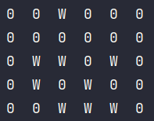
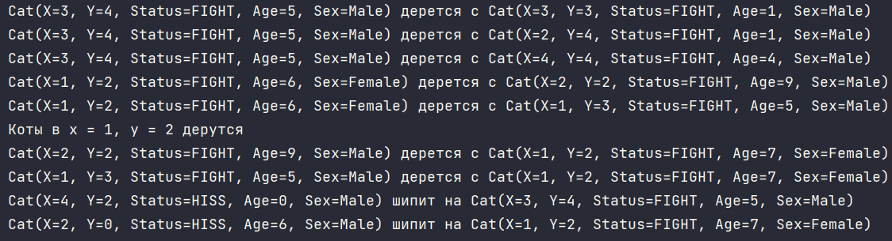
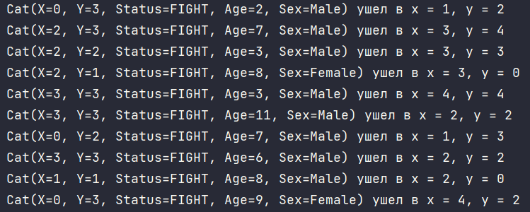
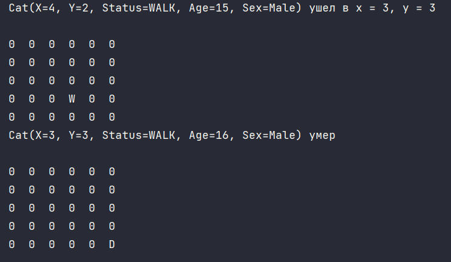
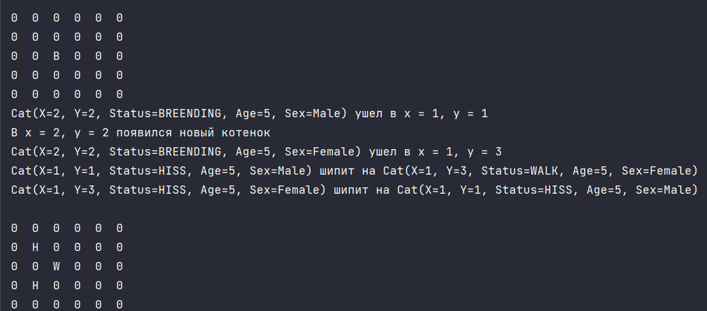

# AngryCats

Это приложение предлагает упрощенную модель поведения и взаимодействия котов. Включает такие аспекты кошачьего поведения, как:

- Размножение
- Смертность
- Агрессия (драки и шипение)
- Свободное перемещение

Для взаимодействия с приложением доступны графический интерфейс и консольная утилита.

## Технологии и запуск

Проект написан на **Kotlin** и использует [Gradle](https://gradle.org/).

Для сборки и запуска приложения используйте Gradle Tool Window или выполните команды в терминале:

- `./gradlew run` — собрать и запустить приложение.
- `./gradlew build` — только собрать приложение.
- `./gradlew ktlintCheck` — выполнить линтинг.
- `./gradlew ktlintFormat` — выполнить форматирование.
- `./gradlew test` — выполнить тесты.

Проект использует многомодульную структуру и состоит из подпроектов `app` и `lib`. Общая логика сборки вынесена в плагин-конвенцию, расположенную в директории `buildSrc`.

Для декларации и версионирования зависимостей используется каталог версий (см. `gradle/libs.versions.toml`). Также применяются кэш сборки и кэш конфигурации (см. `gradle.properties`).

---

## Правила взаимодействия котов

### Возможное поведение котов:

1. **FIGHT**
   - Если расстояние между двумя котами не превышает заданной дистанции `r0`, коты начинают драться.

2. **HISS**
   - Если расстояние между двумя котами не превышает заданной дистанции `r1`, коты начинают шипеть друг на друга с вероятностью, обратно пропорциональной расстоянию.
   - Кот может начать шипеть на дерущегося или размножающегося кота, если на момент проверки он находится в статусе **Walk**.

3. **WALK**
   - Если в радиусе, меньшем чем `r0`, нет других котов, или если кот не начал шипеть на других котов в радиусе `r1`, то кот находится в статусе **Walk**.

4. **BREEDING**
   - Если несколько котов разного пола находятся в одной клетке и при этом в радиусе `r0` нет котов в состоянии **Fight**, коты начинают размножаться.

5. **DEAD**
   - Если возраст кота превышает 30 (может изменяться), кот умирает.

---

## Функции расстояния

В проекте доступны следующие типы вычисления расстояния:

- **Euclidean distance** (Евклидово расстояние)
- **Manhattan distance** (Манхэттенское расстояние)
- **Chebyshev distance** (Расстояние Чебышева)

---

## Консольная утилита

Для работы с консольной утилитой необходимо указать размер карты, количество котов, радиус драки и радиус шипения. Например:

```kotlin
val height = 5
val width = 5
val amountCats = 10
val r0 = 1.0
val r1 = 3.0
```

### Создание котов

Для создания списка котов можно использовать следующую функцию:

```kotlin
val cats = createCats(amountCats, height, width)
```

### Вывод расположения котов на карте

Чтобы вывести расположение котов, используйте:

```kotlin
Print(Map(width, height, cats).visualCatsMap())
```



Дополнительный столбец справа отображает умерших котов.

### Обновление статусов котов

Чтобы обновить статусы котов, используйте:

```kotlin
UpdateStatus(cats, r0, r1)
```

По умолчанию логирование выключено, а для расчета расстояния используется **Euclidean distance**.

Для включения логирования и изменения типа расстояния, используйте:

```kotlin
UpdateStatus(cats, r0, r1, true, NameDistance.Manhattan)
```

Логирование позволяет отслеживать все взаимодействия котов.



### Перемещение котов

Для перемещения котов используйте:

```kotlin
Map(width, height, cats).moveCats()
```

Чтобы включить логирование перемещений, используйте:

```kotlin
Map(width, height, cats, true).moveCats()
```

Логирование покажет, кто куда переместился:



### Возраст котов

Возраст кота увеличивается только при его перемещении. Если возраст превышает 15 (может изменяться), кот умирает и попадает на кладбище в правом столбце.

Пример для одного кота:



### Размножение котов

Если несколько котов противоположного пола оказываются в одной клетке, при следующем перемещении в этой клетке появляется новый котенок.

Для примера создадим двух котов разных полов в одной клетке:

```kotlin
val cats = mutableListOf(
    Cat(2, 2, Sex.Male, 4, Status.WALK),
    Cat(2, 2, Sex.Female, 4, Status.WALK)
)
```

Затем используем следующий код:

```kotlin
UpdateStatus(cats, r0, r1)
Print(Map(width, height, cats).visualCatsMap())

Map(width, height, cats).moveCats()
UpdateStatus(cats, r0, r1)
Print(Map(width, height, cats).visualCatsMap())
```

Это приведет к следующему результату:

