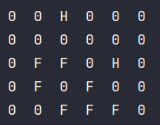

# AngryCats

Данное приложение предлагает упрощенную модель поведения и взаимодействия котов.
Оно включает в себя такие аспекты кошачьего поведения, как размножение, смертность, 
агрессия (драки и шипение), а также свободное перемещение.
Для его использования предлагается графическое приложение и консольная утилита.

# Консольная утилита

Для ее работы необходимо указать размер карты, количество котов, радиус драки и радиус шипения.

``` kotlin
val height = 5
val width = 5
val amountCats = 10
val r0 = 1.0
val r1 = 3.0
```

Для создания списка котов можно воспользоваться следующей функцией, чтобы не пришлось это делать в ручную.
``` kotlin
val cats = createCats(amountCats, height, width)
```

Вывести их расположение на карте можно следующим образом:
``` kotlin
Print(Map(width, height, cats).visualCatsMap())
```


Дополнительный столбец справа предназначен для умерших котов.

Чтобы обновить статусы необходимо использовать следующую функцию:
``` kotlin
UpdateStatus(cats, r0, r1)
```
Благодаря встроенному логированию можно отследить все взаимодействия котов.


Вывод котов на карте с обновленными статусами:



Для перемещения котов предназначена следующая функция:

```kotlin
Map(width, height, cats).moveCats()
```

Логирование также покажет кто куда ушел:


Считается что возраст кота увеличивается только при передвижении.
Если он превысит 15, то кот попадет на кладбище в правом столбце.
Вот пример для одного кота:


Если несколько котов противоположного пола окажутся в одной клетке, то при следующем перемещении в этой клетке окажется новый котенок.

Для примера создадим двух котов разных полов в одной клетке.
```kotlin
val cats = mutableListOf(
        Cat(2, 2, Sex.Male, 4, Status.WALK),
        Cat(2, 2, Sex.Female, 4, Status.WALK)
    )
```

Тогда следующий код:
```kotlin
UpdateStatus(cats, r0, r1)
Print(Map(width, height, cats).visualCatsMap())


Map(width, height, cats).moveCats()
UpdateStatus(cats, r0, r1)
Print(Map(width, height, cats).visualCatsMap())
```
предоставит:
